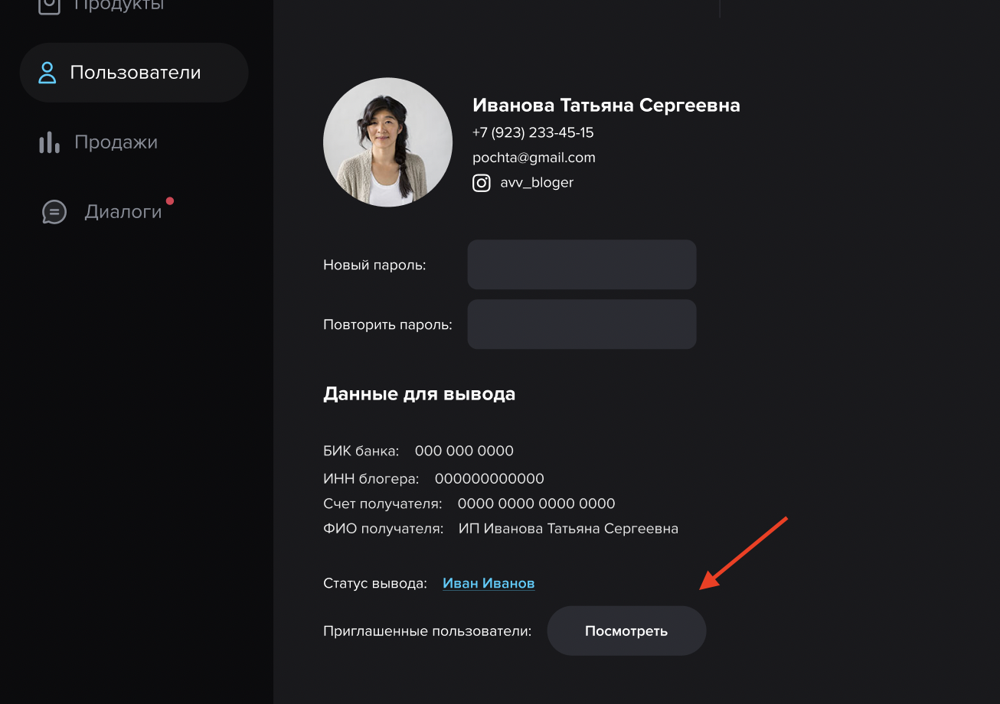

# Admin panel

## Вывод денег

### 1. Деньги в банке

> - Текущий баланс по <span style="color:red"> **всем успешным транзакциям**</span> и деньгам готовым к выводу блогерам/площадке?

### 2. Всего выведено


> - Баланс по всем успешным транзакциям <span style="color:red">**после**</span> вывода денег блогерам/площадке?


### 3. Общий доход

> - Баланс по всем успешным транзакциям <span style="color:red">**до**</span> вывода денег блогерам/площадке?

### 4. Создать вывод


> - Нет дизайна
> - Какая механика по клику на кнопку?


### 5. Что это за страница, как на нее попасть и для чего она нужна если в фигме есть #1(все запросы) и #3 экран(запросы пользователя)?


### 6. Кнопка - Обработать

> - Какая механика по клику на кнопку?


> - Нужно уточнение статусов заявки: В процессе, Ошибка.
> - Поиск работает по: ФИО, инсте?

---

## Продукты

### 1. Редактирование продукта


> 1. Партнерская программа
> - Какое распределение % по умолчанию?

> 2. Гео
> - Для чего нужно?

### 2. Все продукты

> - Что обозначают (шт) в таблице? Это количество продаж товара?
> - Последний столбец это общая сумма продаж?

---

## Пользователи

### 1. Все пользователи

```
- Столбец На счету: актуальный баланс пользователя?
- Всего заработано: итого за весь период с момента регистрации?
- От партнеров: вся сумма от своей сети партнеров за все время?
- Как считается эта сумма от партнерской сети?

Пример:
Продукт стоит 100 рублей. 
Условия вознаграждения в админке у продукта:
1. Блогер - 60%
2. 1 level - 5%
3. 2 level - 2%
4. 3 level - 1%

Прошла успешная продажа. 

Блогер получил: 
- от своей продажи 60 рублей,
- от продажи 1 level 5 рублей,
- от продажи 2 level 2 рубля,
- от продажи 3 level 1 рубль

Итого: 68 рублей, включая партнерскую сеть 8 рублей.
```
В таблице выводятся следующие данные:
| Пользователь      | Всего заработано | От партнеров     |
| :---        |    :----:   |          ---: |
| Татьяна Иванова      | 68       | 8   |

> - Поиск работает по: ФИО, инсте, e-mail?

### 2. Пользователь

> - Что значит статус вывода денег? 
> - Сделано ссылкой, какое событие происходит при клике?
> - Может пользователь создать 2 запроса на вывод сразу или только один запрос и после проведения другой?
> - Приглашенные пользователи, где эта страница?


---
> - Нет дизайна
> - Какая механика по клику на кнопку? 


---

## Продажи

> - Поиск работает по: Номеру платежа, Продавецу, Покупателю?

---

## Сообщения

> - Не совсем понимаю для чего поле Имя пользователя. От службы поддержки имя одно вроде - Служба поддержки.. Так? 🙂
> - Для чего нужен попап окно, поле для сообщения то уже есть. Прямо в этом поле ведб сообщение писать нужно и отправлять по иконке слева, верно?
> 

> Не хватает статуса сообщения
> 


<p style="text-align:center; color:red" > ⚠️ Бюджет раздела - СООБЩЕНИЯ пока не считал</p>
---

# DB Structure


___

# Referral Program

