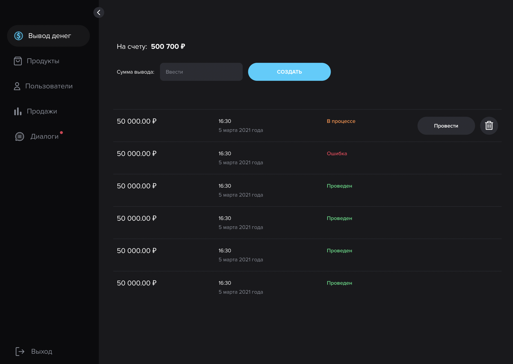
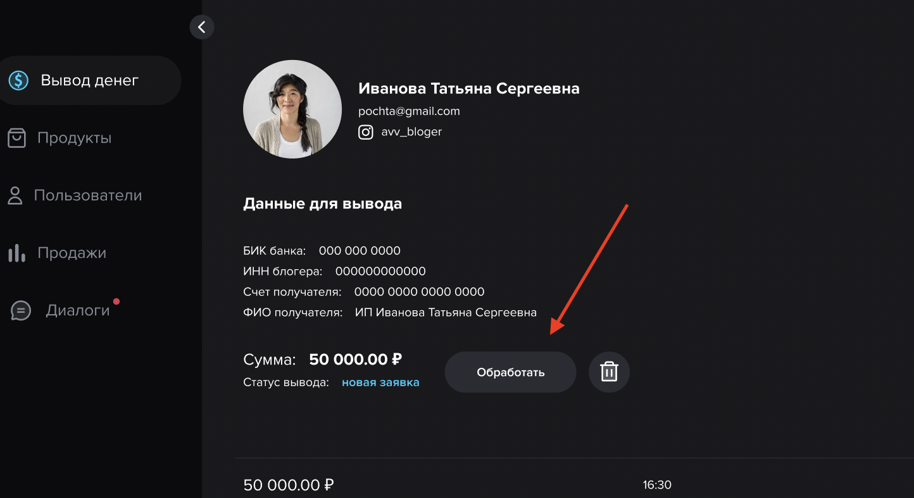
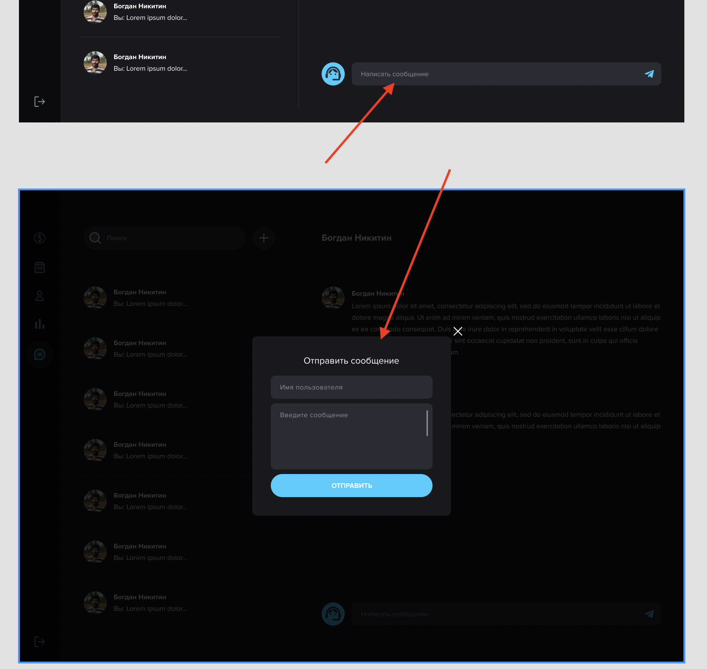
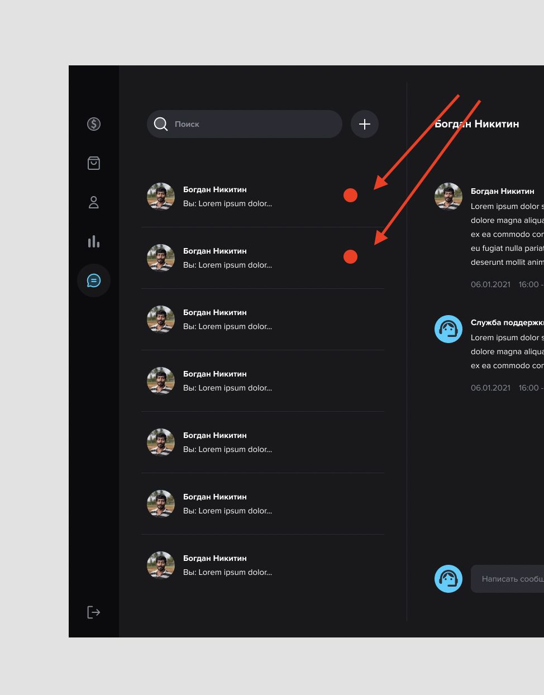

# Admin panel

## Вывод денег

### 1. Деньги в банке

> - Текущий баланс по <span style="color:red"> **всем успешным транзакциям**</span> и деньгам готовым к выводу блогерам/площадке

### 2. Всего выведено


> - Баланс по всем успешным транзакциям <span style="color:red">**после**</span> вывода денег блогерам/площадке


### 3. Общий доход

> - Баланс по всем успешным транзакциям <span style="color:red">**до**</span> вывода денег блогерам/площадке

### 4. Создать вывод


> - Переход на эту страницу осуществляется по кнопке Создать вывод


### 5. Экран #2. Переход на эту страницу осуществляется по кнопке Создать вывод с первого #1 экрана. Вывод расчитан для администратора.

Статусы переводов:
- В процессе (новый при создании)
- Проведен
- Ошибка



### 6. Кнопка - Обработать

> - Какая механика по клику на кнопку?


> - Статуса заявки: В процессе, Ошибка, Проведен.
> - Поиск работает по: ФИО, инсте

---

## Продукты

### 1. Редактирование продукта


> 1. Партнерская программа
> Распределение % по умолчанию: 
> Блогер - 60%, 
> 1 level - 5%,
> 2 level - 2%,
> 3 level - 1%

> 2. Гео
> - Если поле в админке не заполнено, то скрываем у пользователя.

### 2. Все продукты

> - (шт) в таблице - Это количество продаж товара
> - Последний столбец это общая сумма продаж

---

## Пользователи

### 1. Все пользователи

```
- Столбец На счету: актуальный баланс пользователя?
- Всего заработано: итого за весь период с момента регистрации?
- От партнеров: вся сумма от своей сети партнеров за все время?
- Как считается эта сумма от партнерской сети?

Пример:
Продукт стоит 100 рублей. 
Условия вознаграждения в админке у продукта:
1. Блогер - 60%
2. 1 level - 5%
3. 2 level - 2%
4. 3 level - 1%

Прошла успешная продажа. 

Блогер получил: 
- от своей продажи 60 рублей,
- от продажи 1 level 5 рублей,
- от продажи 2 level 2 рубля,
- от продажи 3 level 1 рубль

Итого: 68 рублей, включая партнерскую сеть 8 рублей.

UPD:

Коля
Продал 100 товар

1. Женя (пригласил Сергей - 3 уровень)
Продал 100 товар
60% 
Получает 60 Р

2. Сергей (пригласил Иван - 2 уровень) пригласил Женю
5%
Получает 5 Р от продажи Жени
Cумма от партнерской сети 5 Р от продажи Жени

3. Иван (пригласил Алексей - 1 уровень) пригласил Сергея
2%
Получает 2 Р от продажи Жени
Cумма от партнерской сети 2 Р от продажи Жени

4. Алексей (первое звено - Блогер) пригласил Ивана
1%
Получает 1 Р от продажи Жени
Cумма от партнерской сети 1 Р от продажи Жени
```

### 2. Пользователь

> - Приглашенные пользователи, это страница по типу Всех пользователей.

---

## Продажи

> - Поиск работает по: Номеру платежа, Продавцу,

---

## Сообщения

> - Попап окно нужно когда создается новое сообщение с выбором пользователя из БД.
> - Появляется попап при клике на иконку + рядом с полем поиска.
> 

> Нужно сделать статуса сообщения (новое/прочитано)
> 


<p style="text-align:center; color:red" > ⚠️ Бюджет раздела - СООБЩЕНИЯ пока не считал</p>
---

# DB Structure


___

# Referral Program

