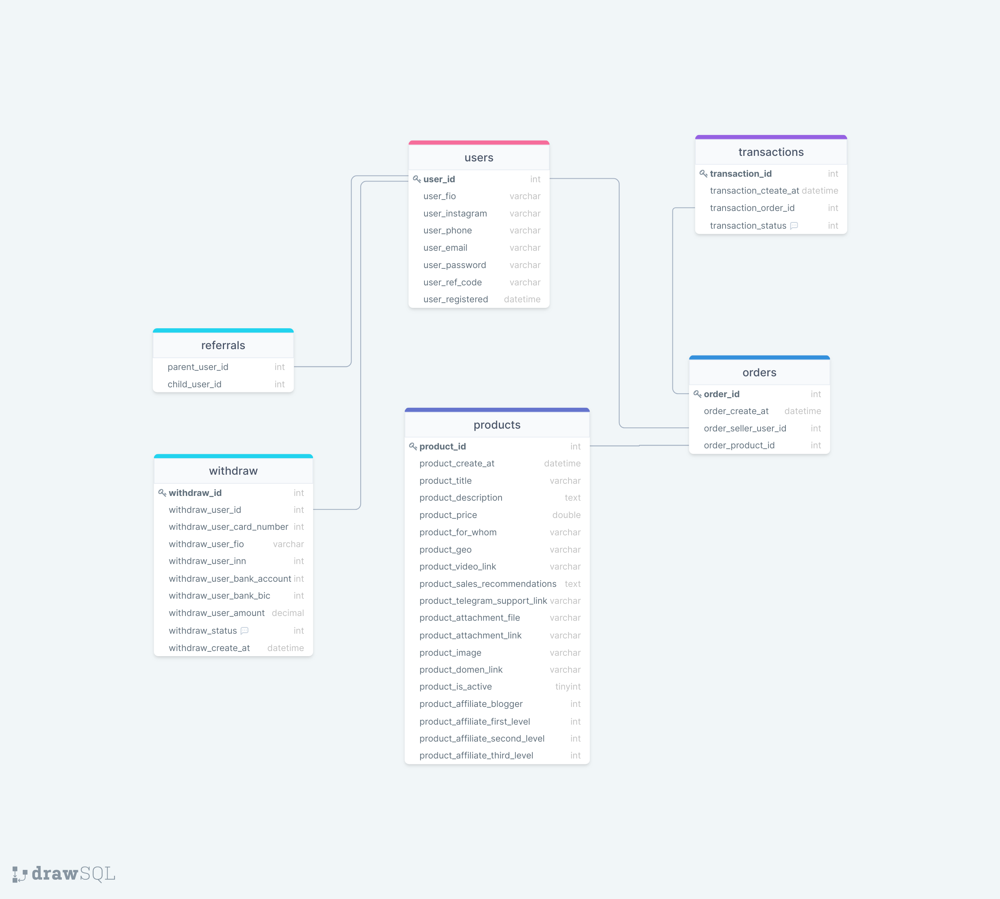
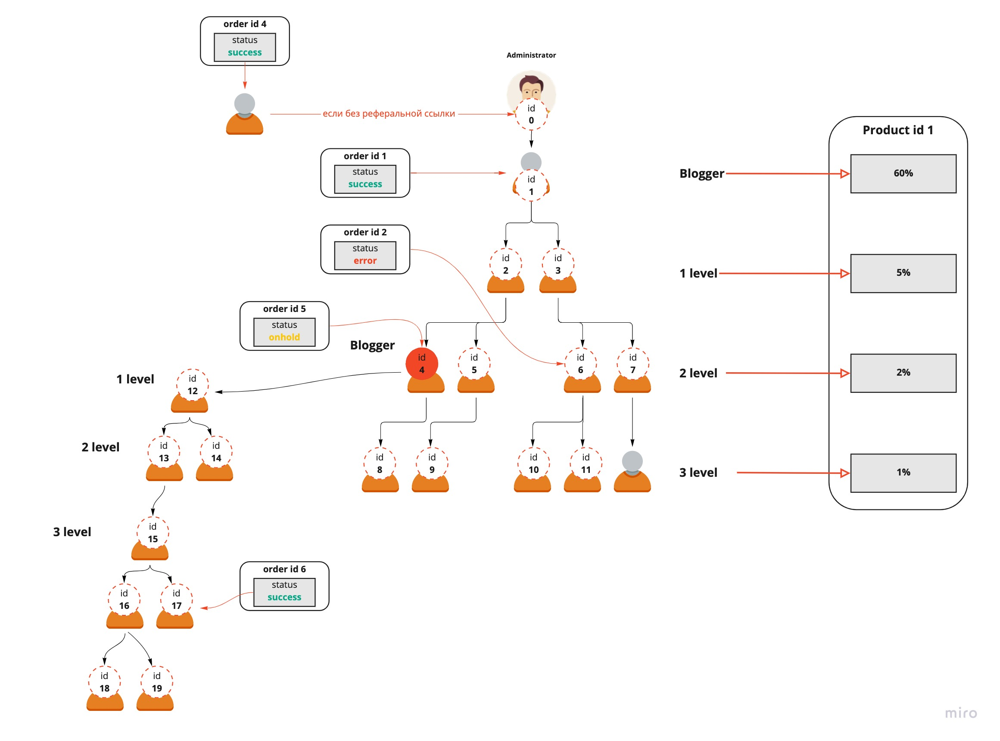

# Admin panel
## Продукты
### 1. Редактирование продукта
```
1. Партнерская программа
- Какое распределение % по умолчанию?

2. Гео
- Для чего нужно?
```
### 2. Все продукты
```
- Что обозначают (шт) в таблице? Это количество продаж товара?
- Последний столбец это общая сумма продаж?
```
---

## Пользователи
### 1. Все пользователи
```
- Столбец На счету: актуальный балланс пользователя?
- Всего заработано: итого за весь период с момента регистрации?
- От партнеров: вся сумма от своей сети партнеров за все время?
- Как считается эта сумма от партнерской сети?

Пример:
Продукт стоит 100 рублей. 
Условия вознаграждения в админке у продукта:
1. Блогер - 60%
2. 1 level - 5%
3. 2 level - 2%
4. 3 level - 1%

Прошли 4 сделки в рамках реферальной цепочки, 
- одна продажа блогера,
- одна продажа 1 level,
- одна продажа 2 level,
- одна продажа 3 level,

Блогер получил: 
- от своей продажи 60 рублей,
- от продажи 1 level 5 рублей,
- от продажи 2 level 2 рубля,
- от продажи 3 level 1 рубль

Итого: 68 рублей, включая партнерскую сеть 8 рублей.

```
В таблице выводятся следующие данные:
| Пользователь      | Всего заработано | От партнеров     |
| :---        |    :----:   |          ---: |
| Татьяна Иванова      | 68       | 8   |

### 2. Пользователь
```
- Что значит статус вывода? 
- Сделано ссылкой, какое событие происходит при клике?
- Может пользователь создать 2 запроса на вывод сразу или только один запрос и после проведения другой?
- Приглашенные пользователи, где эта страница?
```
---

# DB Structure

___

# Referral Program
